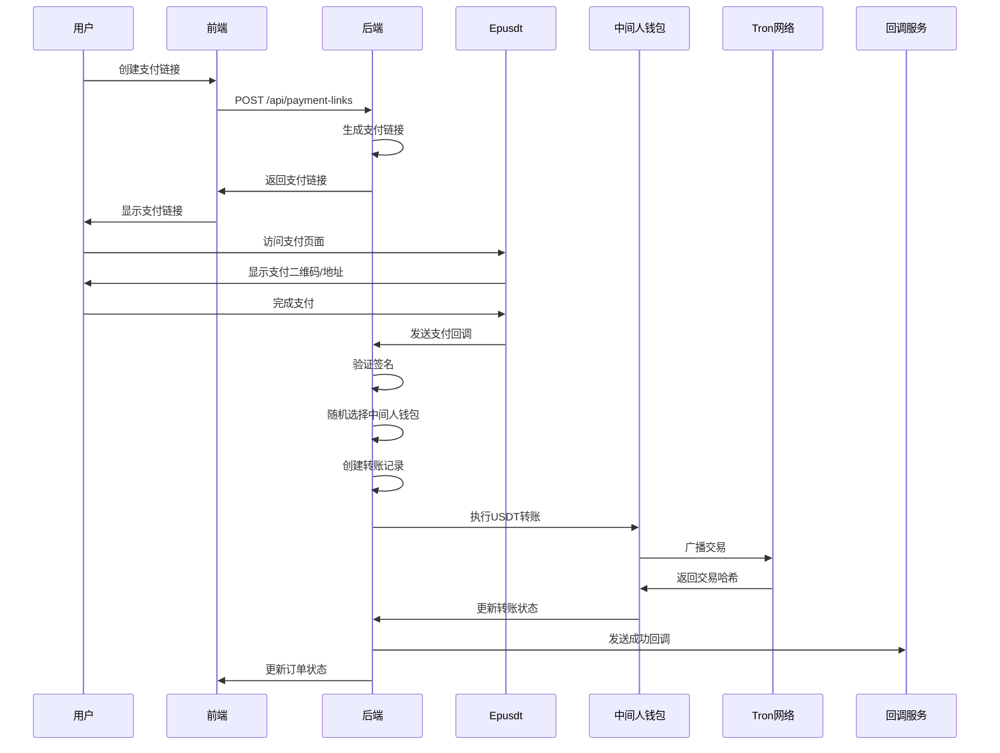

# 数字货币收款网关 - 技术实现文档

> 📖 **项目概览和快速入门请参考**: [README.md](./README.md)

本文档提供数字货币收款网关的详细技术实现说明，包括架构设计、API参考、部署配置等开发者所需的技术细节。

## 目录

1. [系统概述](#系统概述)
2. [技术架构详解](#技术架构详解)
3. [核心功能实现](#核心功能实现)
4. [API接口文档](#api接口文档)
5. [部署配置指南](#部署配置指南)
6. [安全机制详解](#安全机制详解)
7. [性能优化](#性能优化)
8. [故障排除](#故障排除)
9. [开发指南](#开发指南)
10. [测试用例](#测试用例)

> 💡 **快速入门**: 如需快速了解项目概况和部署，请先参考 [README.md](README.md)

## 系统概述

### 技术选型

本系统采用现代化的技术栈，确保高性能、高可用性和易维护性：

**后端技术栈**:
- **Go 1.19+**: 高性能编译型语言，天然支持并发
- **Gin Framework**: 轻量级Web框架，性能优异
- **GORM**: 功能强大的ORM框架，支持多种数据库
- **Redis**: 高性能缓存和会话存储
- **MySQL**: 可靠的关系型数据库

**前端技术栈**:
- **React 18**: 现代化前端框架，组件化开发
- **TypeScript**: 类型安全的JavaScript超集
- **Material-UI**: Google Material Design组件库
- **Axios**: 基于Promise的HTTP客户端

**区块链技术**:
- **TRC20协议**: 基于TRON网络的代币标准
- **TronGrid API**: 官方区块链数据接口
- **WebSocket**: 实时区块链事件监听

### 系统特性

- **高并发处理**: 支持每秒处理数千笔订单
- **实时监控**: 毫秒级区块链事件响应
- **自动化运维**: 智能故障检测和恢复
- **插件化架构**: 支持第三方系统集成
- **多钱包管理**: 智能钱包轮询和负载均衡

---

## 技术架构详解

### 整体架构图

```
┌─────────────────────────────────────────────────────────────┐
│                    数字货币收款网关系统                        │
├─────────────────────────────────────────────────────────────┤
│  前端层 (Frontend Layer)                                    │
│  ┌─────────────────┐  ┌─────────────────┐                   │
│  │  管理后台 (Admin) │  │  支付页面 (Pay)  │                   │
│  │  React + TS     │  │  React + TS     │                   │
│  └─────────────────┘  └─────────────────┘                   │
├─────────────────────────────────────────────────────────────┤
│  API网关层 (API Gateway)                                     │
│  ┌─────────────────────────────────────────────────────────┐ │
│  │  Gin Router + JWT Auth + Rate Limiting                 │ │
│  └─────────────────────────────────────────────────────────┘ │
├─────────────────────────────────────────────────────────────┤
│  业务逻辑层 (Business Logic Layer)                           │
│  ┌─────────────────┐  ┌─────────────────┐  ┌──────────────┐ │
│  │  支付服务        │  │  钱包服务        │  │  通知服务     │ │
│  │  PaymentService │  │  WalletService  │  │  NotifyService│ │
│  └─────────────────┘  └─────────────────┘  └──────────────┘ │
├─────────────────────────────────────────────────────────────┤
│  数据访问层 (Data Access Layer)                              │
│  ┌─────────────────┐  ┌─────────────────┐  ┌──────────────┐ │
│  │  MySQL          │  │  Redis          │  │  File System │ │
│  │  (主数据存储)    │  │  (缓存/会话)     │  │  (日志/配置)  │ │
│  └─────────────────┘  └─────────────────┘  └──────────────┘ │
├─────────────────────────────────────────────────────────────┤
│  外部接口层 (External Interface Layer)                       │
│  ┌─────────────────┐  ┌─────────────────┐  ┌──────────────┐ │
│  │  TronGrid API   │  │  Telegram Bot   │  │  Webhook     │ │
│  │  (区块链数据)    │  │  (消息通知)      │  │  (回调通知)   │ │
│  └─────────────────┘  └─────────────────┘  └──────────────┘ │
└─────────────────────────────────────────────────────────────┘
```

### 核心组件详解

#### 1. Epusdt支付引擎

**架构设计**:
```go
// 核心支付引擎结构
type PaymentEngine struct {
    WalletManager    *WalletManager    // 钱包管理器
    OrderProcessor   *OrderProcessor   // 订单处理器
    BlockchainMonitor *BlockchainMonitor // 区块链监听器
    CallbackHandler  *CallbackHandler  // 回调处理器
    Cache           *redis.Client     // 缓存客户端
    DB              *gorm.DB          // 数据库连接
}

// 钱包管理器
type WalletManager struct {
    Wallets         []Wallet          // 钱包池
    LoadBalancer    *LoadBalancer     // 负载均衡器
    HealthChecker   *HealthChecker    // 健康检查器
}

// 订单处理器
type OrderProcessor struct {
    Queue           chan Order        // 订单队列
    Workers         []*Worker         // 工作协程池
    Validator       *OrderValidator   // 订单验证器
}
```

**工作流程**:
1. **订单创建**: 接收支付请求，生成唯一订单ID
2. **钱包分配**: 从钱包池中选择可用钱包地址
3. **金额计算**: 生成精确的支付金额（避免重复）
4. **区块链监听**: 实时监控钱包地址的入账事件
5. **订单确认**: 验证交易有效性并更新订单状态
6. **回调通知**: 向商户系统发送支付结果通知

#### 2. Payment Link MVP系统

**前端架构**:
```typescript
// React组件架构
src/
├── components/           // 通用组件
│   ├── Layout/          // 布局组件
│   ├── Forms/           // 表单组件
│   └── UI/              // UI组件
├── pages/               // 页面组件
│   ├── Dashboard/       // 仪表板
│   ├── PaymentLinks/    // 支付链接管理
│   └── Orders/          // 订单管理
├── services/            // API服务
│   ├── api.ts           // API客户端
│   ├── auth.ts          // 认证服务
│   └── payment.ts       // 支付服务
├── hooks/               // 自定义Hooks
├── utils/               // 工具函数
└── types/               // TypeScript类型定义
```

**后端架构**:
```go
// Gin路由架构
internal/
├── handlers/            // HTTP处理器
│   ├── auth.go         // 认证处理器
│   ├── payment.go      // 支付处理器
│   └── order.go        // 订单处理器
├── services/            // 业务逻辑服务
│   ├── auth_service.go // 认证服务
│   ├── payment_service.go // 支付服务
│   └── order_service.go // 订单服务
├── models/              // 数据模型
├── middleware/          // 中间件
└── config/              // 配置管理
```

### 数据库设计

#### 核心表结构

**订单表 (orders)**:
```sql
CREATE TABLE orders (
    id BIGINT PRIMARY KEY AUTO_INCREMENT,
    order_id VARCHAR(64) UNIQUE NOT NULL,
    amount DECIMAL(20,8) NOT NULL,
    actual_amount DECIMAL(20,8),
    currency VARCHAR(10) DEFAULT 'USDT',
    wallet_address VARCHAR(64) NOT NULL,
    status ENUM('pending','paid','expired','failed') DEFAULT 'pending',
    tx_hash VARCHAR(128),
    callback_url TEXT,
    expire_time TIMESTAMP,
    created_at TIMESTAMP DEFAULT CURRENT_TIMESTAMP,
    updated_at TIMESTAMP DEFAULT CURRENT_TIMESTAMP ON UPDATE CURRENT_TIMESTAMP,
    INDEX idx_order_id (order_id),
    INDEX idx_wallet_address (wallet_address),
    INDEX idx_status (status),
    INDEX idx_created_at (created_at)
);
```

**钱包表 (wallets)**:
```sql
CREATE TABLE wallets (
    id BIGINT PRIMARY KEY AUTO_INCREMENT,
    address VARCHAR(64) UNIQUE NOT NULL,
    private_key TEXT NOT NULL,  -- 加密存储
    balance DECIMAL(20,8) DEFAULT 0,
    status ENUM('active','inactive','maintenance') DEFAULT 'active',
    last_used_at TIMESTAMP,
    created_at TIMESTAMP DEFAULT CURRENT_TIMESTAMP,
    INDEX idx_address (address),
    INDEX idx_status (status)
);
```

**支付链接表 (payment_links)**:
```sql
CREATE TABLE payment_links (
    id BIGINT PRIMARY KEY AUTO_INCREMENT,
    link_id VARCHAR(32) UNIQUE NOT NULL,
    user_id BIGINT NOT NULL,
    title VARCHAR(255) NOT NULL,
    description TEXT,
    amount DECIMAL(20,8) NOT NULL,
    currency VARCHAR(10) DEFAULT 'USDT',
    status ENUM('active','inactive','expired') DEFAULT 'active',
    expire_at TIMESTAMP,
    created_at TIMESTAMP DEFAULT CURRENT_TIMESTAMP,
    INDEX idx_link_id (link_id),
    INDEX idx_user_id (user_id),
    INDEX idx_status (status)
);
```

### 后端技术栈
- **语言**: Go 1.21+
- **框架**: Gin (Web框架)
- **数据库**: MySQL 8.0+
- **ORM**: GORM
- **缓存**: Redis
- **容器化**: Docker & Docker Compose

### 前端技术栈
- **框架**: React 18 + TypeScript
- **UI库**: Material-UI (MUI)
- **状态管理**: React Hooks
- **路由**: React Router
- **HTTP客户端**: Axios

### 外部集成
- **Epusdt**: USDT支付网关
- **Tron API**: 区块链交互
- **TronGrid**: 交易广播
- **TronScan**: 网络费用查询

---

## 🚀 核心功能

### 1. 用户功能
- **支付链接管理**: 创建、查看、删除支付链接
- **回调配置**: 为每个支付链接配置回调地址
- **订单查看**: 查看支付订单状态和历史

### 2. 管理员功能
- **中间人钱包管理**: 添加、删除、启用/禁用钱包
- **费率配置**: 设置固定手续费率和网络手续费范围
- **转账记录**: 查看所有转账记录和状态
- **系统设置**: 配置Epusdt和回调系统参数

### 3. 系统功能
- **自动转账**: 支付成功后自动执行转账
- **手续费计算**: 动态计算固定和网络手续费
- **回调通知**: 向用户配置的回调地址发送通知
- **错误处理**: 完善的错误处理和重试机制

---

## 💳 支付流程

### 完整支付流程



### 详细步骤说明

#### 1. 创建支付链接
```bash
POST /api/payment-links
{
  "title": "商品支付",
  "amount": 100.00,
  "wallet_address": "用户钱包地址",
  "callback_url": "https://example.com/callback"
}
```

#### 2. 用户支付
- 用户访问支付链接
- 系统随机选择一个活跃的中间人钱包
- 生成Epusdt支付页面
- 用户完成USDT支付

#### 3. 支付回调处理
- Epusdt发送支付成功回调
- 系统验证MD5签名
- 更新支付订单状态为"已支付"

#### 4. 自动转账
- 计算手续费（固定费率 + 网络费用）
- 创建转账记录
- 使用中间人钱包私钥签名交易
- 通过TronGrid广播交易
- 更新转账状态

#### 5. 回调通知
- 转账成功后发送回调通知
- 包含支付和转账详细信息
- 使用HMAC-SHA256签名验证

---

## 🏦 中间人钱包机制

### 钱包管理
- **添加钱包**: 管理员添加TRC20钱包地址和私钥
- **随机选择**: 支付时从活跃钱包中随机选择
- **余额管理**: 自动更新钱包余额
- **状态控制**: 支持启用/禁用钱包

### 安全措施
- **私钥加密**: 私钥在数据库中加密存储
- **权限控制**: 只有管理员可以管理钱包
- **状态监控**: 实时监控钱包状态和余额

### 钱包数据结构
```go
type MiddlemanWallet struct {
    ID            uint      `json:"id"`
    Name          string    `json:"name"`
    WalletAddress string    `json:"wallet_address"`
    PrivateKey    string    `json:"-"` // 不返回给前端
    Status        string    `json:"status"` // active/inactive
    Balance       float64   `json:"balance"`
    CreatedAt     time.Time `json:"created_at"`
    UpdatedAt     time.Time `json:"updated_at"`
}
```

---

## 💰 手续费计算

### 手续费组成
1. **固定手续费**: 按支付金额的固定比例收取
2. **网络手续费**: 两次转账的网络费用（动态计算）

### 计算逻辑
```go
// 固定手续费计算
fixedFee := amount * feeRate
if fixedFee < minFee {
    fixedFee = minFee
}
if fixedFee > maxFee {
    fixedFee = maxFee
}

// 网络手续费计算（动态获取）
networkFees := getNetworkFees() // 从TronScan API获取
totalNetworkFee := sum(networkFees)

// 总手续费
totalFee := fixedFee + totalNetworkFee
netAmount := amount - totalFee
```

### 费率配置
- **固定费率**: 1% (可配置)
- **最小手续费**: 0.1 USDT
- **最大手续费**: 10 USDT
- **网络手续费范围**: 0.001-0.01 USDT (动态)

---

## 📞 回调系统

### 回调类型
1. **支付回调**: Epusdt发送的支付成功通知
2. **转账回调**: 系统发送的转账结果通知

### 回调地址配置
- **全局回调**: 系统级别的成功/失败回调地址
- **链接回调**: 每个支付链接的特定回调地址

### 回调数据格式
```json
{
  "payment_id": "订单ID",
  "transfer_id": "转账ID",
  "from_address": "来源地址",
  "to_address": "目标地址",
  "amount": 100.00,
  "fee": 1.50,
  "net_amount": 98.50,
  "status": "success",
  "transaction_hash": "交易哈希",
  "timestamp": "2025-08-25T10:30:00Z",
  "signature": "HMAC-SHA256签名"
}
```

### 签名验证
```go
// 生成签名
signature := hmac.New(sha256.New, []byte(secret))
signature.Write([]byte(data))
signatureHex := hex.EncodeToString(signature.Sum(nil))
```

---

## API接口文档

### Epusdt支付网关API

#### 基础信息
- **Base URL**: `http://localhost:8080/api/v1`
- **认证方式**: API Key (请求头: `X-API-Key: your_api_key`)
- **数据格式**: JSON
- **字符编码**: UTF-8
- **超时设置**: 30秒

#### 核心接口详解

##### 1. 创建支付订单
```http
POST /api/v1/order
Content-Type: application/json
X-API-Key: your_api_key

{
  "amount": 10.5,                    // 支付金额
  "callback_url": "https://your-site.com/callback",  // 回调地址
  "order_id": "your_order_id",       // 商户订单ID (可选)
  "expire_time": 1800,               // 过期时间(秒) 默认30分钟
  "notify_url": "https://your-site.com/notify"  // 通知地址 (可选)
}
```

**响应示例**:
```json
{
  "code": 200,
  "message": "success",
  "data": {
    "order_id": "EP2024010112345678",      // 系统订单ID
    "amount": 10.5,                       // 原始金额
    "actual_amount": 10.52,               // 实际支付金额(含精度)
    "wallet_address": "TXYZabc123...",     // 收款钱包地址
    "expire_time": 1800,                  // 过期时间
    "qr_code": "data:image/png;base64,..." // 支付二维码
  }
}
```

##### 2. 查询订单状态
```http
GET /api/v1/order/{order_id}
X-API-Key: your_api_key
```

**响应示例**:
```json
{
  "code": 200,
  "message": "success",
  "data": {
    "order_id": "EP2024010112345678",
    "status": "paid",                     // pending/paid/expired/failed
    "amount": 10.5,
    "actual_amount": 10.52,
    "tx_hash": "0x1234567890abcdef...",    // 交易哈希
    "created_at": "2024-01-01T12:00:00Z",
    "paid_at": "2024-01-01T12:05:30Z"
  }
}
```

##### 3. 获取钱包余额
```http
GET /api/v1/wallet/balance
X-API-Key: your_api_key
```

##### 4. 批量查询订单
```http
GET /api/v1/orders?status=pending&limit=50&offset=0
X-API-Key: your_api_key
```

##### 5. 回调通知格式
当支付状态变化时，系统向`callback_url`发送POST请求：
```json
{
  "order_id": "EP2024010112345678",
  "merchant_order_id": "your_order_id",   // 商户订单ID
  "amount": 10.5,
  "actual_amount": 10.52,
  "status": "paid",
  "tx_hash": "0x1234567890abcdef...",
  "timestamp": 1704067200,
  "signature": "sha256_signature"          // HMAC-SHA256签名
}
```

**签名验证**:
```go
func VerifySignature(data, signature, secret string) bool {
    h := hmac.New(sha256.New, []byte(secret))
    h.Write([]byte(data))
    expectedSignature := hex.EncodeToString(h.Sum(nil))
    return signature == expectedSignature
}
```

### Payment Link MVP API

#### 基础信息
- **Base URL**: `http://localhost:8081/api`
- **认证方式**: JWT Token (请求头: `Authorization: Bearer {token}`)
- **数据格式**: JSON

#### 认证接口

##### 1. 用户注册
```http
POST /api/auth/register
Content-Type: application/json

{
  "username": "testuser",
  "email": "test@example.com",
  "password": "password123",
  "confirm_password": "password123"
}
```

##### 2. 用户登录
```http
POST /api/auth/login
Content-Type: application/json

{
  "email": "test@example.com",
  "password": "password123"
}
```

**响应示例**:
```json
{
  "code": 200,
  "message": "登录成功",
  "data": {
    "token": "eyJhbGciOiJIUzI1NiIsInR5cCI6IkpXVCJ9...",
    "user": {
      "id": 1,
      "username": "testuser",
      "email": "test@example.com"
    }
  }
}
```

#### 支付链接管理

##### 1. 创建支付链接
```http
POST /api/payment-links
Authorization: Bearer {jwt_token}
Content-Type: application/json

{
  "title": "商品购买",
  "description": "商品详细描述",
  "amount": 99.99,
  "currency": "USDT",
  "expire_hours": 24,                    // 过期时间(小时)
  "callback_url": "https://your-site.com/callback"
}
```

##### 2. 获取支付链接列表
```http
GET /api/payment-links?page=1&limit=20&status=active
Authorization: Bearer {jwt_token}
```

##### 3. 更新支付链接
```http
PUT /api/payment-links/{link_id}
Authorization: Bearer {jwt_token}
Content-Type: application/json

{
  "title": "更新后的标题",
  "amount": 199.99,
  "status": "active"
}
```

##### 4. 删除支付链接
```http
DELETE /api/payment-links/{link_id}
Authorization: Bearer {jwt_token}
```

#### 订单管理

##### 1. 获取订单列表
```http
GET /api/orders?page=1&limit=20&status=paid
Authorization: Bearer {jwt_token}
```

##### 2. 获取订单详情
```http
GET /api/orders/{order_id}
Authorization: Bearer {jwt_token}
```

#### 统计接口

##### 1. 获取仪表板数据
```http
GET /api/dashboard/stats
Authorization: Bearer {jwt_token}
```

**响应示例**:
```json
{
  "code": 200,
  "data": {
    "total_orders": 1250,
    "total_amount": 125000.50,
    "success_rate": 95.2,
    "today_orders": 45,
    "today_amount": 4500.25
  }
}
```

### 错误码说明

| 错误码 | 说明 | 解决方案 |
|--------|------|----------|
| 200 | 请求成功 | - |
| 400 | 请求参数错误 | 检查请求参数格式和必填字段 |
| 401 | 未授权访问 | 检查API Key或JWT Token |
| 403 | 权限不足 | 确认账户权限和API访问范围 |
| 404 | 资源不存在 | 检查请求的资源ID是否正确 |
| 429 | 请求频率超限 | 降低请求频率或联系管理员 |
| 500 | 服务器内部错误 | 联系技术支持 |

### API使用示例

#### JavaScript/Node.js
```javascript
const axios = require('axios');

// 创建支付订单
async function createOrder() {
  try {
    const response = await axios.post('http://localhost:8080/api/v1/order', {
      amount: 10.5,
      callback_url: 'https://your-site.com/callback'
    }, {
      headers: {
        'X-API-Key': 'your_api_key',
        'Content-Type': 'application/json'
      }
    });
    
    console.log('订单创建成功:', response.data);
    return response.data;
  } catch (error) {
    console.error('创建订单失败:', error.response.data);
  }
}
```

#### Python
```python
import requests
import json

def create_order():
    url = 'http://localhost:8080/api/v1/order'
    headers = {
        'X-API-Key': 'your_api_key',
        'Content-Type': 'application/json'
    }
    data = {
        'amount': 10.5,
        'callback_url': 'https://your-site.com/callback'
    }
    
    response = requests.post(url, headers=headers, json=data)
    
    if response.status_code == 200:
        print('订单创建成功:', response.json())
        return response.json()
    else:
        print('创建订单失败:', response.text)
```

#### PHP
```php
<?php
function createOrder() {
    $url = 'http://localhost:8080/api/v1/order';
    $data = [
        'amount' => 10.5,
        'callback_url' => 'https://your-site.com/callback'
    ];
    
    $options = [
        'http' => [
            'header' => [
                'X-API-Key: your_api_key',
                'Content-Type: application/json'
            ],
            'method' => 'POST',
            'content' => json_encode($data)
        ]
    ];
    
    $context = stream_context_create($options);
    $result = file_get_contents($url, false, $context);
    
    return json_decode($result, true);
}
?>
```

---

## 部署配置指南

> 基础部署步骤请参考 [README.md](./README.md#快速部署指南)

### 高级配置选项

#### 环境变量配置
```bash
# 生产环境配置
export EPUSDT_ENV=production
export EPUSDT_LOG_LEVEL=info
export EPUSDT_MAX_CONNECTIONS=100
export EPUSDT_TIMEOUT=30s

# 安全配置
export EPUSDT_JWT_SECRET=your-jwt-secret
export EPUSDT_API_KEY=your-api-key
export EPUSDT_WEBHOOK_SECRET=your-webhook-secret
```

#### 数据库优化配置
```sql
-- MySQL 性能优化
SET GLOBAL innodb_buffer_pool_size = 256*1024*1024;
SET GLOBAL max_connections = 200;
SET GLOBAL query_cache_size = 64*1024*1024;
SET GLOBAL innodb_log_file_size = 64*1024*1024;
```

#### 负载均衡配置
```nginx
# Nginx 配置示例
upstream epusdt_backend {
    server 127.0.0.1:8080;
    server 127.0.0.1:8081;
    server 127.0.0.1:8082;
}

server {
    listen 80;
    server_name your-domain.com;
    
    location /api/ {
        proxy_pass http://epusdt_backend;
        proxy_set_header Host $host;
        proxy_set_header X-Real-IP $remote_addr;
    }
}
```

---

## 测试与质量保证

> 基础测试信息请参考 [README.md](./README.md#测试)

### 自动化测试框架

#### 单元测试
```go
// 支付处理单元测试
func TestPaymentProcessor(t *testing.T) {
    processor := NewPaymentProcessor()
    
    testCases := []struct {
        name     string
        amount   *big.Int
        address  string
        expected error
    }{
        {"valid_payment", big.NewInt(1000000), "TValidAddress", nil},
        {"invalid_amount", big.NewInt(0), "TValidAddress", ErrInvalidAmount},
        {"invalid_address", big.NewInt(1000000), "invalid", ErrInvalidAddress},
    }
    
    for _, tc := range testCases {
        t.Run(tc.name, func(t *testing.T) {
            err := processor.ProcessPayment(tc.amount, tc.address)
            assert.Equal(t, tc.expected, err)
        })
    }
}
```

#### 集成测试
```typescript
// API 集成测试
describe('Payment API Integration', () => {
  let server: TestServer;
  
  beforeAll(async () => {
    server = await createTestServer();
  });
  
  test('should create payment link', async () => {
    const response = await request(server.app)
      .post('/api/payment-links')
      .send({
        amount: 100,
        currency: 'USDT',
        description: 'Test payment'
      })
      .expect(201);
      
    expect(response.body).toHaveProperty('id');
    expect(response.body.amount).toBe(100);
  });
  
  test('should process payment callback', async () => {
    const paymentData = {
      txHash: '0x123...',
      amount: 100,
      status: 'confirmed'
    };
    
    const response = await request(server.app)
      .post('/api/callbacks/payment')
      .send(paymentData)
      .expect(200);
      
    expect(response.body.success).toBe(true);
  });
});
```

#### 性能测试
```javascript
// 负载测试脚本
import http from 'k6/http';
import { check, sleep } from 'k6';

export let options = {
  stages: [
    { duration: '2m', target: 100 },
    { duration: '5m', target: 100 },
    { duration: '2m', target: 200 },
    { duration: '5m', target: 200 },
    { duration: '2m', target: 0 },
  ],
};

export default function () {
  let response = http.post('http://localhost:8080/api/payment-links', {
    amount: 100,
    currency: 'USDT',
    description: 'Load test payment'
  });
  
  check(response, {
    'status is 201': (r) => r.status === 201,
    'response time < 500ms': (r) => r.timings.duration < 500,
  });
  
  sleep(1);
}
```

---

## ❓ 常见问题

### Q1: 为什么转账记录页面白屏？
**A**: 前端接口定义与后端数据结构不匹配。已修复：
- 更新了 `TransferRecord` 接口定义
- 修正了字段名称映射
- 添加了状态值支持

### Q2: 如何配置中间人钱包？
**A**: 
1. 登录管理员账户
2. 访问"中间人钱包管理"
3. 点击"添加钱包"
4. 输入钱包名称、地址和私钥
5. 确保钱包有足够的TRX和USDT余额

### Q3: 手续费如何计算？
**A**: 
- 固定手续费 = 支付金额 × 费率（1%）
- 网络手续费 = 动态获取（从TronScan API）
- 总手续费 = 固定手续费 + 网络手续费

### Q4: 如何配置回调地址？
**A**: 
1. 创建支付链接时填写回调地址
2. 或在系统设置中配置全局回调地址
3. 回调会包含HMAC-SHA256签名用于验证

### Q5: 支付失败怎么办？
**A**: 
1. 检查中间人钱包余额
2. 确认私钥正确性
3. 查看转账记录的错误信息
4. 检查网络连接和API配置

### Q6: 如何监控系统状态？
**A**: 
1. 查看转账记录状态
2. 监控中间人钱包余额
3. 检查回调通知日志
4. 使用健康检查接口

---

## 故障排除与运维

> 基础技术支持信息请参考 [README.md](./README.md#技术支持与社区)

### 系统监控

#### 健康检查端点
```go
// 健康检查实现
func HealthCheckHandler(c *gin.Context) {
    status := gin.H{
        "status": "healthy",
        "timestamp": time.Now().Unix(),
        "version": "1.0.0",
        "services": gin.H{
            "database": checkDatabaseHealth(),
            "redis": checkRedisHealth(),
            "blockchain": checkBlockchainHealth(),
        },
    }
    
    c.JSON(200, status)
}

func checkDatabaseHealth() string {
    if err := db.Ping(); err != nil {
        return "unhealthy"
    }
    return "healthy"
}
```

#### 性能指标监控
```go
// Prometheus 指标收集
var (
    paymentCounter = prometheus.NewCounterVec(
        prometheus.CounterOpts{
            Name: "payments_total",
            Help: "Total number of payments processed",
        },
        []string{"status", "currency"},
    )
    
    paymentDuration = prometheus.NewHistogramVec(
        prometheus.HistogramOpts{
            Name: "payment_duration_seconds",
            Help: "Payment processing duration",
        },
        []string{"method"},
    )
)

func init() {
    prometheus.MustRegister(paymentCounter)
    prometheus.MustRegister(paymentDuration)
}
```

### 日志分析

#### 结构化日志
```go
// 使用 logrus 进行结构化日志
func LogPaymentEvent(event string, paymentID string, data map[string]interface{}) {
    logrus.WithFields(logrus.Fields{
        "event":      event,
        "payment_id": paymentID,
        "timestamp":  time.Now().Unix(),
        "data":       data,
    }).Info("Payment event logged")
}

// 使用示例
LogPaymentEvent("payment_created", paymentID, map[string]interface{}{
    "amount":   amount,
    "currency": currency,
    "user_id":  userID,
})
```

#### 错误追踪
```go
// 错误上下文追踪
type ErrorContext struct {
    RequestID string
    UserID    string
    Action    string
    Timestamp time.Time
    Stack     string
}

func LogError(err error, ctx ErrorContext) {
    logrus.WithFields(logrus.Fields{
        "error":      err.Error(),
        "request_id": ctx.RequestID,
        "user_id":    ctx.UserID,
        "action":     ctx.Action,
        "timestamp":  ctx.Timestamp,
        "stack":      ctx.Stack,
    }).Error("Application error occurred")
}
```

### 数据库维护

#### 性能优化查询
```sql
-- 查找慢查询
SELECT query, mean_time, calls, total_time
FROM pg_stat_statements
ORDER BY mean_time DESC
LIMIT 10;

-- 索引使用情况
SELECT schemaname, tablename, attname, n_distinct, correlation
FROM pg_stats
WHERE tablename = 'payment_links'
ORDER BY n_distinct DESC;

-- 表空间使用情况
SELECT 
    schemaname,
    tablename,
    pg_size_pretty(pg_total_relation_size(schemaname||'.'||tablename)) as size
FROM pg_tables
ORDER BY pg_total_relation_size(schemaname||'.'||tablename) DESC;
```

#### 数据清理脚本
```sql
-- 清理过期的支付链接
DELETE FROM payment_links 
WHERE status = 'expired' 
AND created_at < NOW() - INTERVAL '30 days';

-- 归档历史交易记录
INSERT INTO transfer_records_archive 
SELECT * FROM transfer_records 
WHERE created_at < NOW() - INTERVAL '1 year';

DELETE FROM transfer_records 
WHERE created_at < NOW() - INTERVAL '1 year';
```

---

## 📝 更新日志

### v1.0.0 (2025-08-25)
- ✅ 初始版本发布
- ✅ 中间人钱包机制
- ✅ 自动转账功能
- ✅ 回调系统
- ✅ 管理员界面
- ✅ 费率配置

### 待开发功能
- 🔄 多币种支持
- 🔄 批量转账
- 🔄 高级统计报表
- 🔄 移动端适配
- 🔄 多语言支持

## 📋 相关文档

- **[README.md](./README.md)** - 项目概览和快速入门指南
  - [项目介绍](./README.md#项目介绍)
  - [核心组件概览](./README.md#核心组件概览)
  - [快速部署指南](./README.md#快速部署指南)
  - [API接口概览](./README.md#api接口概览)
  - [安全考虑](./README.md#安全考虑)
  - [技术支持与社区](./README.md#技术支持与社区)

---

*最后更新: 2025-08-25*
*版本: v1.0.0*
