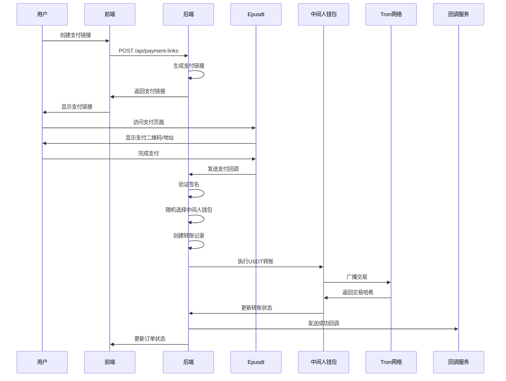

# 支付系统完整说明文档

## 📋 目录
1. [系统概述](#系统概述)
2. [技术架构](#技术架构)
3. [核心功能](#核心功能)
4. [支付流程](#支付流程)
5. [中间人钱包机制](#中间人钱包机制)
6. [手续费计算](#手续费计算)
7. [回调系统](#回调系统)
8. [API接口](#api接口)
9. [部署说明](#部署说明)
10. [测试指南](#测试指南)
11. [常见问题](#常见问题)

---

## 🎯 系统概述

### 系统简介
这是一个基于中间人钱包的USDT支付系统，支持用户创建支付链接，通过随机中间人钱包接收支付，然后自动转账到用户指定的钱包地址。

### 核心特点
- 🔄 **中间人钱包机制**：随机选择中间人钱包接收支付，提高安全性
- 💰 **自动转账**：支付成功后自动扣除手续费并转账到用户钱包
- ⚙️ **灵活费率**：支持固定比例手续费和动态网络手续费
- 📞 **回调通知**：支持支付成功/失败的回调通知
- 🛡️ **安全机制**：私钥加密存储，签名验证等安全措施

---

## 🏗️ 技术架构

### 后端技术栈
- **语言**: Go 1.21+
- **框架**: Gin (Web框架)
- **数据库**: MySQL 8.0+
- **ORM**: GORM
- **缓存**: Redis
- **容器化**: Docker & Docker Compose

### 前端技术栈
- **框架**: React 18 + TypeScript
- **UI库**: Material-UI (MUI)
- **状态管理**: React Hooks
- **路由**: React Router
- **HTTP客户端**: Axios

### 外部集成
- **Epusdt**: USDT支付网关
- **Tron API**: 区块链交互
- **TronGrid**: 交易广播
- **TronScan**: 网络费用查询

---

## 🚀 核心功能

### 1. 用户功能
- **支付链接管理**: 创建、查看、删除支付链接
- **回调配置**: 为每个支付链接配置回调地址
- **订单查看**: 查看支付订单状态和历史

### 2. 管理员功能
- **中间人钱包管理**: 添加、删除、启用/禁用钱包
- **费率配置**: 设置固定手续费率和网络手续费范围
- **转账记录**: 查看所有转账记录和状态
- **系统设置**: 配置Epusdt和回调系统参数

### 3. 系统功能
- **自动转账**: 支付成功后自动执行转账
- **手续费计算**: 动态计算固定和网络手续费
- **回调通知**: 向用户配置的回调地址发送通知
- **错误处理**: 完善的错误处理和重试机制

---

## 💳 支付流程

### 完整支付流程



### 详细步骤说明

#### 1. 创建支付链接
```bash
POST /api/payment-links
{
  "title": "商品支付",
  "amount": 100.00,
  "wallet_address": "用户钱包地址",
  "callback_url": "https://example.com/callback"
}
```

#### 2. 用户支付
- 用户访问支付链接
- 系统随机选择一个活跃的中间人钱包
- 生成Epusdt支付页面
- 用户完成USDT支付

#### 3. 支付回调处理
- Epusdt发送支付成功回调
- 系统验证MD5签名
- 更新支付订单状态为"已支付"

#### 4. 自动转账
- 计算手续费（固定费率 + 网络费用）
- 创建转账记录
- 使用中间人钱包私钥签名交易
- 通过TronGrid广播交易
- 更新转账状态

#### 5. 回调通知
- 转账成功后发送回调通知
- 包含支付和转账详细信息
- 使用HMAC-SHA256签名验证

---

## 🏦 中间人钱包机制

### 钱包管理
- **添加钱包**: 管理员添加TRC20钱包地址和私钥
- **随机选择**: 支付时从活跃钱包中随机选择
- **余额管理**: 自动更新钱包余额
- **状态控制**: 支持启用/禁用钱包

### 安全措施
- **私钥加密**: 私钥在数据库中加密存储
- **权限控制**: 只有管理员可以管理钱包
- **状态监控**: 实时监控钱包状态和余额

### 钱包数据结构
```go
type MiddlemanWallet struct {
    ID            uint      `json:"id"`
    Name          string    `json:"name"`
    WalletAddress string    `json:"wallet_address"`
    PrivateKey    string    `json:"-"` // 不返回给前端
    Status        string    `json:"status"` // active/inactive
    Balance       float64   `json:"balance"`
    CreatedAt     time.Time `json:"created_at"`
    UpdatedAt     time.Time `json:"updated_at"`
}
```

---

## 💰 手续费计算

### 手续费组成
1. **固定手续费**: 按支付金额的固定比例收取
2. **网络手续费**: 两次转账的网络费用（动态计算）

### 计算逻辑
```go
// 固定手续费计算
fixedFee := amount * feeRate
if fixedFee < minFee {
    fixedFee = minFee
}
if fixedFee > maxFee {
    fixedFee = maxFee
}

// 网络手续费计算（动态获取）
networkFees := getNetworkFees() // 从TronScan API获取
totalNetworkFee := sum(networkFees)

// 总手续费
totalFee := fixedFee + totalNetworkFee
netAmount := amount - totalFee
```

### 费率配置
- **固定费率**: 1% (可配置)
- **最小手续费**: 0.1 USDT
- **最大手续费**: 10 USDT
- **网络手续费范围**: 0.001-0.01 USDT (动态)

---

## 📞 回调系统

### 回调类型
1. **支付回调**: Epusdt发送的支付成功通知
2. **转账回调**: 系统发送的转账结果通知

### 回调地址配置
- **全局回调**: 系统级别的成功/失败回调地址
- **链接回调**: 每个支付链接的特定回调地址

### 回调数据格式
```json
{
  "payment_id": "订单ID",
  "transfer_id": "转账ID",
  "from_address": "来源地址",
  "to_address": "目标地址",
  "amount": 100.00,
  "fee": 1.50,
  "net_amount": 98.50,
  "status": "success",
  "transaction_hash": "交易哈希",
  "timestamp": "2025-08-25T10:30:00Z",
  "signature": "HMAC-SHA256签名"
}
```

### 签名验证
```go
// 生成签名
signature := hmac.New(sha256.New, []byte(secret))
signature.Write([]byte(data))
signatureHex := hex.EncodeToString(signature.Sum(nil))
```

---

## 🔌 API接口

### 用户接口

#### 认证
```bash
POST /api/auth/login
POST /api/auth/register
```

#### 支付链接
```bash
GET    /api/payment-links          # 获取支付链接列表
POST   /api/payment-links          # 创建支付链接
GET    /api/payment-links/:id      # 获取支付链接详情
DELETE /api/payment-links/:id      # 删除支付链接
```

#### 支付订单
```bash
POST   /api/payments               # 创建支付订单
GET    /api/payments/:id           # 获取订单详情
GET    /api/payments/:id/status    # 查询支付状态
```

### 管理员接口

#### 中间人钱包
```bash
GET    /api/admin/middleman-wallets     # 获取钱包列表
POST   /api/admin/middleman-wallets     # 添加钱包
PUT    /api/admin/middleman-wallets/:id/status  # 更新钱包状态
DELETE /api/admin/middleman-wallets/:id # 删除钱包
```

#### 转账记录
```bash
GET    /api/admin/transfer-records      # 获取转账记录
GET    /api/admin/transfer-records/:id  # 获取单个记录
POST   /api/admin/transfer-records/:id/process  # 手动处理转账
```

#### 费率配置
```bash
GET    /api/admin/fee-config            # 获取费率配置
PUT    /api/admin/fee-config            # 更新费率配置
POST   /api/admin/fee-config            # 创建费率配置
```

#### 系统设置
```bash
GET    /api/admin/epusdt/config         # 获取Epusdt配置
PUT    /api/admin/epusdt/config         # 更新Epusdt配置
POST   /api/admin/epusdt/test-connection # 测试Epusdt连接

GET    /api/admin/callback/config       # 获取回调配置
PUT    /api/admin/callback/config       # 更新回调配置
POST   /api/admin/callback/test         # 测试回调
```

### 回调接口
```bash
POST   /api/payments/notify             # Epusdt支付回调
```

---

## 🚀 部署说明

### 环境要求
- Docker 20.10+
- Docker Compose 2.0+
- 4GB+ RAM
- 10GB+ 磁盘空间

### 快速部署

#### 1. 克隆项目
```bash
git clone <repository-url>
cd payment-link-mvp
```

#### 2. 配置环境变量
```bash
# 复制环境变量模板
cp .env.example .env

# 编辑环境变量
vim .env
```

#### 3. 启动服务
```bash
# Windows
start-all.bat

# Linux/Mac
./start-all.sh
```

#### 4. 访问系统
- 前端: http://localhost:3001
- 后端: http://localhost:8080
- 管理后台: http://localhost:3001/admin

### 环境变量配置
```env
# 数据库配置
DB_HOST=localhost
DB_PORT=3306
DB_NAME=payment_system
DB_USER=root
DB_PASSWORD=password

# Redis配置
REDIS_HOST=localhost
REDIS_PORT=6379
REDIS_PASSWORD=

# JWT密钥
JWT_SECRET=your-jwt-secret

# Epusdt配置
EPUSDT_BASE_URL=http://localhost:8000
EPUSDT_PASSWORD=epusdt_password_xasddawqe

# 回调配置
CALLBACK_SUCCESS_URL=https://your-domain.com/callback/success
CALLBACK_FAIL_URL=https://your-domain.com/callback/fail
CALLBACK_NOTIFY_SECRET=your-callback-secret

# Tron配置
TRON_NETWORK=mainnet
TRONGRID_API_KEY=your-trongrid-api-key
```

---

## 🧪 测试指南

### 测试脚本

#### 1. 转账记录测试
```bash
python test_transfer_records.py
```

#### 2. 完整支付流程测试
```bash
python test_complete_payment_flow.py
```

#### 3. 前端功能测试
```bash
python test_frontend_fix.py
```

### 测试场景

#### 基本功能测试
1. **用户注册/登录**
2. **创建支付链接**
3. **支付流程**
4. **转账执行**
5. **回调通知**

#### 管理员功能测试
1. **中间人钱包管理**
2. **费率配置**
3. **转账记录查看**
4. **系统设置**

#### 异常情况测试
1. **网络异常**
2. **余额不足**
3. **私钥错误**
4. **回调失败**

---

## ❓ 常见问题

### Q1: 为什么转账记录页面白屏？
**A**: 前端接口定义与后端数据结构不匹配。已修复：
- 更新了 `TransferRecord` 接口定义
- 修正了字段名称映射
- 添加了状态值支持

### Q2: 如何配置中间人钱包？
**A**: 
1. 登录管理员账户
2. 访问"中间人钱包管理"
3. 点击"添加钱包"
4. 输入钱包名称、地址和私钥
5. 确保钱包有足够的TRX和USDT余额

### Q3: 手续费如何计算？
**A**: 
- 固定手续费 = 支付金额 × 费率（1%）
- 网络手续费 = 动态获取（从TronScan API）
- 总手续费 = 固定手续费 + 网络手续费

### Q4: 如何配置回调地址？
**A**: 
1. 创建支付链接时填写回调地址
2. 或在系统设置中配置全局回调地址
3. 回调会包含HMAC-SHA256签名用于验证

### Q5: 支付失败怎么办？
**A**: 
1. 检查中间人钱包余额
2. 确认私钥正确性
3. 查看转账记录的错误信息
4. 检查网络连接和API配置

### Q6: 如何监控系统状态？
**A**: 
1. 查看转账记录状态
2. 监控中间人钱包余额
3. 检查回调通知日志
4. 使用健康检查接口

---

## 📞 技术支持

### 联系方式
- **邮箱**: support@example.com
- **文档**: https://docs.example.com
- **GitHub**: https://github.com/example/payment-system

### 日志位置
- **后端日志**: `logs/backend.log`
- **前端日志**: 浏览器开发者工具
- **Docker日志**: `docker-compose logs`

### 故障排除
1. 检查服务状态: `docker-compose ps`
2. 查看日志: `docker-compose logs [service]`
3. 重启服务: `docker-compose restart [service]`
4. 重建镜像: `docker-compose up --build`

---

## 📝 更新日志

### v1.0.0 (2025-08-25)
- ✅ 初始版本发布
- ✅ 中间人钱包机制
- ✅ 自动转账功能
- ✅ 回调系统
- ✅ 管理员界面
- ✅ 费率配置

### 待开发功能
- 🔄 多币种支持
- 🔄 批量转账
- 🔄 高级统计报表
- 🔄 移动端适配
- 🔄 多语言支持

---

*最后更新: 2025-08-25*
*版本: v1.0.0*
